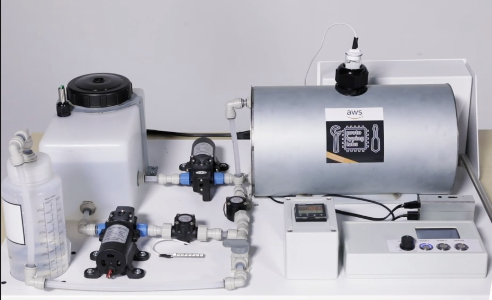
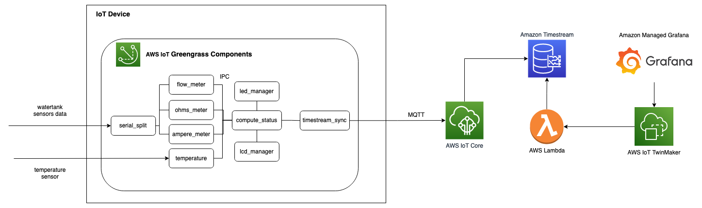
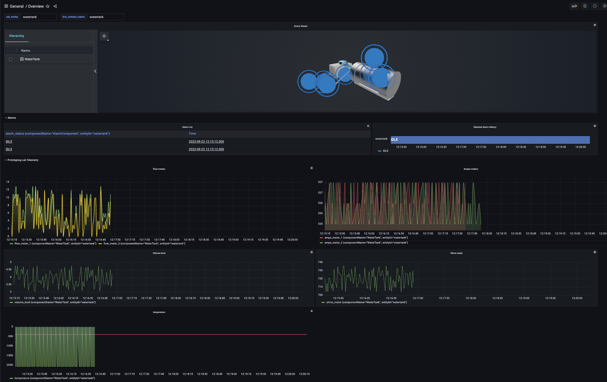

# Industrial IoT Digital Twin (The Water Tank Demo)

The Water Tank demo is a fully functioning water system including a supply tank, a storage tank and pumps to exchange water between the two reservoirs. It allows the monitoring in Virtual Reality of flow rates, water volume in the reservoirs, temperature, and leaks.



The use case illustrated by this demo applies to industrial companies who need to monitor their water tanks in treatment facilities while deployed in poorly accessible areas. It provides a system allowing operations to perform remote supervision, raise alerts when anomalies are detected and limit on-site intervention costs.

## Architecture



## Deployment

The project is built using CDK IaC. So it can be deployed to your AWS account with a single deploy command.

### Virtual or Real Water Tank

Since this demo was intended to demonstrate monitoring a real hardware device in our AWS Lab ( the water tank ). This project by default spins up a virtual water tank, so that you can still deploy to you AWS Account and see and explore all of the same features and benefits that this solution has to offer. This is controlled by a feature flag boolean in [cdk.json](./cdk.json) file called `virtual`.

There are 2 ways to deploy the CDK stack to your account. One is directly from your local machine with a single deploy command, the other is through a CICD Pipeline which will be triggered on every change you do to the repo it connects to.

### Pre-requisites

- Ensure your AWS credentials are in place for your account
- Ensure you have [Node.js](https://nodejs.org) and [Docker](https://www.docker.com/products/docker-desktop/) installed
- Bootstrap your account:
  In the root folder, run the following commands
  ```
  npm ci
  npm run cdk bootstrap -- --toolkit-stack-name CDKToolkit-Water-Tank --qualifier watertank
  ```

### deploy stack directly (bypassing CI/CD. You can always activate the CI/CD afterwards following the next section's instruction)

1. Clone this repo.
1. in your AWS Account [enable AWS IAM Identity Center and create a user for yourself](https://console.aws.amazon.com/singlesignon/identity/home)
1. In the root folder, run the following commands
   ```
   npm run deploy
   ```
1. For any future changes you just need to redeploy using `npm run deploy`

### deploy stack through CICD Pipeline

1. Fork this repo.
1. Clone your fork locally.
1. You need to set up a connection between the pipeline and your Github Repo
   1. Follow the steps to create & very the connection [here](https://docs.aws.amazon.com/dtconsole/latest/userguide/connections-create-github.html)
   1. Go to [cdk.json](./cdk.json) and paste you connection Arn int the connectionArn field
   1. Please also fill your Repo name and branch fields
1. in your AWS Account [enable AWS IAM Identity Center and create a user for yourself](https://console.aws.amazon.com/singlesignon/identity/home)
1. Finally in the root folder, run the following commands
   ```
   npm run deploy-pipeline
   ```
1. This is the only time you need to run commands locally, for any future changes just push new commits to your repo and the pipeline redeploy the new code changes.

### Setup the raspberry PI (only if physical)

This steps assume you have an SD Card and Raspberry PI

1. Make sure your backend is configured to work against a physical hardware:
   1. Set to `false` the `virtual` flag in `cdk.json`
   1. Redeploy the stack (directly or through CI/CD with a git commit)
1. Install Raspeberry Pi OS Lite (64-bit) on a SD card:
   1. Download [Raspberry Pi Imager](https://www.raspberrypi.com/software/)
   1. Launch the imager
   1. Select the right image: `Raspeberry Pi OS (other)` > `Raspeberry Pi OS Lite (64-bit)`
   1. Select the right drive
   1. Set up a the **Wifi** (you can create a hotspot with your phone for instance) and **ssh credentials** by clicking on the _gear_ on the bottom right:
      1. Check `Enable SSH`
      1. Set username and password
      1. Check `Configure Wireless LAN` (This connection will help you connect to the pi from your computer after the first boot)
      1. Set Wifi `SSID` and `Password`
      1. Save
   1. Click `Write` button to write the image to the SD card
1. Connect to your Raspberry Pi:
   1. Start your Raspberry Pi with SD Card plugged in it
   1. SSH to it by connecting your PC to the network you set up in the previous steps (`ssh pi@raspberrypi.local`)
1. Install the missing dependencies:
   1. Install Java and pip3 using apt
      ```
      sudo apt-get update
      sudo apt-get install default-jre python3-pip docker.io
      ```
   1. Create ggc_user and give it permission to run docker commands
      ```
      sudo useradd ggc_user && sudo groupadd ggc_group && sudo usermod -aG ggc_group ggc_user && sudo usermod -aG docker ggc_user
      ```
   1. Install Greengrass running the following command
      ```
      curl -s https://d2s8p88vqu9w66.cloudfront.net/releases/greengrass-nucleus-latest.zip > greengrass-nucleus-latest.zip && unzip greengrass-nucleus-latest.zip -d GreengrassInstaller
      ```
   1. Register your PI to your backend
      1. The Greengrass installer uses AWS credentials to provision the AWS resources that it requires. You can provide credentials as environment variables. Copy the command below to your device’s terminal. Replace the text after the ‘=’ sign with the specified information. [Learn more](https://docs.aws.amazon.com/console/greengrass/v2/configure-aws-credentials)
         ```
         export AWS_ACCESS_KEY_ID=<AWS_ACCESS_KEY_ID>
         export AWS_SECRET_ACCESS_KEY=<AWS_SECRET_ACCESS_KEY>
         export AWS_SESSION_TOKEN=<AWS_SESSION_TOKEN>
         ```
      1. Run the command given as output of your backend deployment (aka. `npm run deploy`). Something like `sudo -E java -Droot="/greengrass/v2" ...`
1. Configure the interface options:
   1. run `raspi-config`
   1. Go to Interface options
   1. Enable I4, I5, I6 (enable Hardware Serial port only, not login shell), I7 and I8
   1. Reboot your PI !
1. Check the PI is registered to your account:
   1. Go to AWS IOT Core console > Greengrass devices > Core devices > `watertank_01` > Deployments
   1. Check the deployments are `Completed`

You are all set !

## Grafana Dashboard

To see everything in action, we can login to Grafana and checkout our Dashboard to view watertank digital twin and all the metrics.
After deployment the url for our grafana instance will be printed out in your command line or you could get the url from your AWS console by visiting the Managed Grafana service page, however you won't have access yet.
AWS Managed Grafana is using AWS IAM Identity Center for Authorisation previously known as AWS Single Sign-On (SSO).

You should have an IAM Identity User created by now, so we need to give it permission to access our Grafana Instance.

1. Login to your console and visit the Managed Grafana servie page.
1. Go to the grafana workspace created by our deployment.
1. In the Authentication tab, click on `Configure users and user groups`
1. Add your IAM Identity User

Now you are ready to visit grafana dashboard.ra

1. Just visit the grafana url either printed in your terminal or diplayed in your console under Grafana workspace Url.
1. login using your IAM Identity User credentials
1. Visit the dashboard section, choose browse and you can view the dashboard created by our deployment as seen below.

   

## Clean up

To remove all resources created by this stack run the following

```
npm run destroy
```

## Security

See [CONTRIBUTING](CONTRIBUTING.md#security-issue-notifications) for more information.

## License

This library is licensed under the MIT-0 License. See the LICENSE file.
